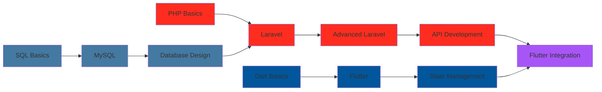

<div align="center">
  
</div>

<div align="center">
  
</div>

---

## 🚀 About Me

```javascript
const p3kzz = {
    location: "Madura, Indonesia 🇮🇩",
    education: "S1 Informatika | Universitas KH. Bahaudin Mudhary",
    role: "Fullstack & Backend Developer",
    specialization: ["Laravel Development", "Flutter Development"],
    currentlyLearning: "Advanced Flutter & Laravel Best Practices",
    techStack: {
        backend: "Laravel",
        frontend: "Tailwind CSS & React",
        mobile: "Flutter",
        database: "MySQL"
    },
    passions: ["Clean Code", "Problem Solving", "Building Scalable Apps"],
    motto: "Code with purpose, learn with passion 🔥"
};
```

Saya seorang mahasiswa Informatika yang passionate dalam menciptakan solusi web dan mobile yang efisien dan scalable. Dengan fokus utama pada **Laravel** untuk Backend Development dan **Flutter** untuk Mobile Development, saya terus mengasah kemampuan untuk membangun aplikasi yang tidak hanya bekerja, tapi bekerja dengan baik.

Saat ini, saya sedang mendalami ekosistem **Laravel** dan **Flutter**, memperluas toolkit saya untuk menciptakan pengalaman lintas platform yang seamless dan powerful.

---

## 🛠️ Tech Stack & Tools

<div align="center">

### 💻 Core Technologies

<table>
  <tr>
    <td align="center" width="33%">
      
      <br><strong>Laravel</strong>
      <br><sub>Backend Framework</sub>
    </td>
    <td align="center" width="33%">
      
      <br><strong>Flutter</strong>
      <br><sub>Mobile Framework</sub>
    </td>
    <td align="center" width="33%">
      
      <br><strong>MySQL</strong>
      <br><sub>Database</sub>
    </td>
  </tr>
</table>

### 🎨 Frontend & Styling


### 💻 Languages


### 🔧 Tools & Environment


</div>

---

## 📊 GitHub Stats

<div align="center">
  
  
</div>

<div align="center">
  
</div>

<div align="center">
  
</div>

---

## 🏆 GitHub Trophies

<div align="center">
  
</div>

---

## 🔥 Current Focus

```yaml
mastering:
  - Laravel:
      - Advanced Eloquent ORM
      - API Development with Laravel
      - Laravel Sanctum & Authentication
      - Queue & Job Processing
      - Laravel Best Practices
  
  - Flutter:
      - State Management (Provider, Riverpod, BLoC)
      - Flutter Widgets & Animations
      - API Integration
      - Local Database (SQLite)
      - Flutter Best Practices
  
  - Database:
      - MySQL Query Optimization
      - Database Design & Normalization
      - Advanced MySQL Features

goals_2025:
  - Build 5+ Laravel Projects
  - Create 3+ Flutter Mobile Apps
  - Contribute to Open Source Projects
  - Master Laravel & Flutter Advanced Features
  - Land an Internship/Job as Backend/Mobile Developer

currently_working_on:
  - E-Commerce Web Application with Laravel & MySQL
  - Mobile App Development with Flutter
  - RESTful API with Laravel for Mobile Apps
  - Personal Portfolio Website
```

---

## 💼 Expertise & Focus Areas

<div align="center">

<table>
  <tr>
    <td align="center" width="50%">
      
      <h3>🌐 Laravel Development</h3>
      <p><strong>Backend & Web Development</strong></p>
      <p>
        • RESTful API Development<br>
        • MVC Architecture<br>
        • Database Management with MySQL<br>
        • Authentication & Authorization<br>
        • Eloquent ORM Mastery
      </p>
    </td>
    <td align="center" width="50%">
      
      <h3>📱 Flutter Development</h3>
      <p><strong>Cross-Platform Mobile Apps</strong></p>
      <p>
        • Beautiful UI/UX Implementation<br>
        • State Management<br>
        • API Integration<br>
        • Local Storage<br>
        • Android & iOS Development
      </p>
    </td>
  </tr>
  <tr>
    <td align="center" width="50%">
      
      <h3>🗄️ Database Management</h3>
      <p><strong>MySQL Expertise</strong></p>
      <p>
        • Database Design<br>
        • Query Optimization<br>
        • Data Modeling<br>
        • Relationship Management<br>
        • Performance Tuning
      </p>
    </td>
    <td align="center" width="50%">
      
      <h3>🎨 Frontend Development</h3>
      <p><strong>Modern UI Implementation</strong></p>
      <p>
        • Tailwind CSS<br>
        • React Components<br>
        • Responsive Design<br>
        • Interactive UI/UX<br>
        • Modern Web Standards
      </p>
    </td>
  </tr>
</table>

</div>

---

## 🎯 Skills Proficiency

```text
Laravel Development    ████████████████████░   95%
Flutter Development    ████████████████░░░░░   80%
MySQL Database         ███████████████████░░   92%
Tailwind CSS           ██████████████████░░░   88%
RESTful API Design     ███████████████████░░   90%
Git & Version Control  ██████████████████░░░   85%
React                  ███████████████░░░░░░   75%
```

---

## 📚 Learning Journey

<div align="center">



</div>

---

## 🌐 Connect With Me

<div align="center">

[](https://linkedin.com/in/muh-afifullah)
[](https://instagram.com/pekz_a)
[](mailto:muhafifullah27@gmail.com)
[](https://www.tiktok.com/@pekz115)

</div>

---

## 💡 Quote of the Day

<div align="center">
  
</div>

---

## 🐍 Contribution Snake

<div align="center">
  <picture>
    <source media="(prefers-color-scheme: dark)" srcset="https://raw.githubusercontent.com/p3kzz/p3kzz/output/github-contribution-grid-snake-dark.svg">
    <source media="(prefers-color-scheme: light)" srcset="https://raw.githubusercontent.com/p3kzz/p3kzz/output/github-contribution-grid-snake.svg">
    
  </picture>
</div>

---

<div align="center">
  
  
  ### 💡 "First, solve the problem. Then, write the code." - John Johnson
  
  Thanks for visiting! Let's build something amazing together 
  
  <p> From <a href="https://github.com/p3kzz">p3kzz</a> with </p>
  
  <p>
    
    
    
  </p>
  
</div>
